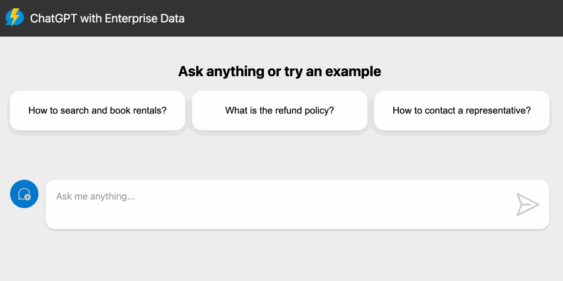
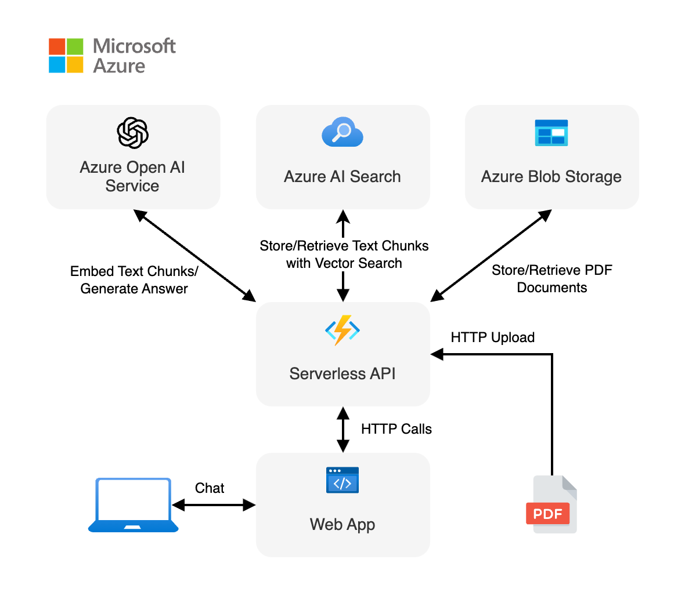
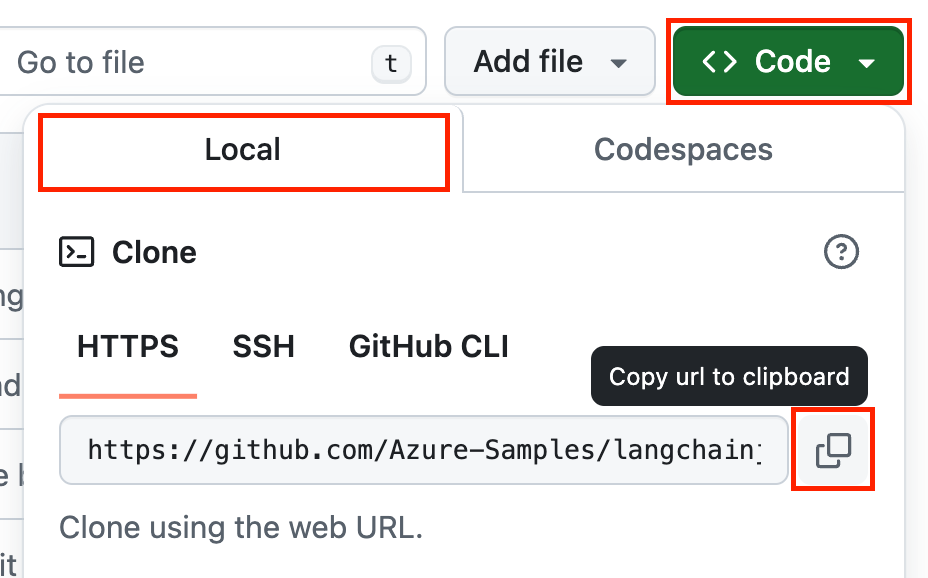
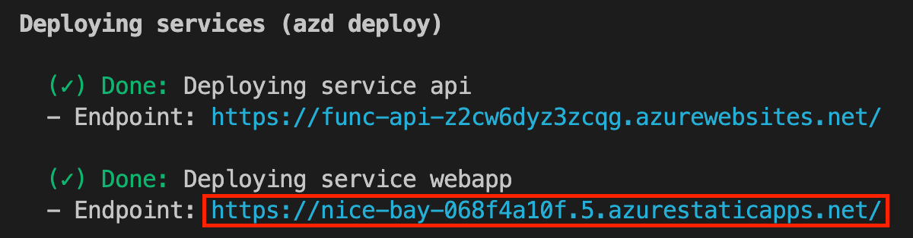

<!-- prettier-ignore -->
<div align="center">


# Serverless AI Chat with RAG using LangChain.js

[](https://codespaces.new/Azure-Samples/serverless-chat-langchainjs?hide_repo_select=true&ref=main&quickstart=true)
[](https://discord.gg/kzRShWzttr)
[](https://learn.microsoft.com/azure/developer/javascript/ai/get-started-app-chat-template-langchainjs)
[](https://www.youtube.com/watch?v=xkFOmx5yxIA&list=PLlrxD0HtieHi5ZpsHULPLxm839IrhmeDk&index=4)
[](https://dev.to/azure/build-a-serverless-chatgpt-with-rag-using-langchainjs-3487)
<br>
[](https://github.com/Azure-Samples/serverless-chat-langchainjs/actions)

[](https://ollama.com/library/llama3.1)
[](https://www.typescriptlang.org)
[](LICENSE)

:star: If you like this sample, star it on GitHub — it helps a lot!

[Overview](#overview) • [Get started](#getting-started) • [Run the sample](#run-the-sample) • [Resources](#resources) • [FAQ](#faq) • [Troubleshooting](#troubleshooting)



</div>

This sample shows how to build a serverless AI chat experience with Retrieval-Augmented Generation using [LangChain.js](https://js.langchain.com/) and Azure. The application is hosted on [Azure Static Web Apps](https://learn.microsoft.com/azure/static-web-apps/overview) and [Azure Functions](https://learn.microsoft.com/azure/azure-functions/functions-overview?pivots=programming-language-javascript), with [Azure Cosmos DB for NoSQL](https://learn.microsoft.com/azure/cosmos-db/nosql/vector-) as the vector database. You can use it as a starting point for building more complex AI applications.

> [!TIP]
> You can test this application locally without any cost using [Ollama](https://ollama.com/). Follow the instructions in the [Local Development](#local-development) section to get started.

## Overview

Building AI applications can be complex and time-consuming, but using LangChain.js and Azure serverless technologies allows to greatly simplify the process. This application is a chatbot that uses a set of enterprise documents to generate responses to user queries.

We provide sample data to make this sample ready to try, but feel free to replace it with your own. We use a fictitious company called _Contoso Real Estate_, and the experience allows its customers to ask support questions about the usage of its products. The sample data includes a set of documents that describes its terms of service, privacy policy and a support guide.

<div align="center">
  
</div>

This application is made from multiple components:

- A web app made with a single chat web component built with [Lit](https://lit.dev) and hosted on [Azure Static Web Apps](https://learn.microsoft.com/azure/static-web-apps/overview). The code is located in the `packages/webapp` folder.

- A serverless API built with [Azure Functions](https://learn.microsoft.com/azure/azure-functions/functions-overview?pivots=programming-language-javascript) and using [LangChain.js](https://js.langchain.com/) to ingest the documents and generate responses to the user chat queries. The code is located in the `packages/api` folder.

- A database to store chat sessions and the text extracted from the documents and the vectors generated by LangChain.js, using [Azure Cosmos DB for NoSQL](https://learn.microsoft.com/azure/cosmos-db/nosql/).

- A file storage to store the source documents, using [Azure Blob Storage](https://learn.microsoft.com/azure/storage/blobs/storage-blobs-introduction).

We use the [HTTP protocol for AI chat apps](https://aka.ms/chatprotocol) to communicate between the web app and the API.

## Features

- **Serverless Architecture**: Utilizes Azure Functions and Azure Static Web Apps for a fully serverless deployment.
- **Retrieval-Augmented Generation (RAG)**: Combines the power of Azure Cosmos DB and LangChain.js to provide relevant and accurate responses.
- **Chat Sessions History**: Maintains a personal chat history for each user, allowing them to revisit previous conversations.
- **Scalable and Cost-Effective**: Leverages Azure's serverless offerings to provide a scalable and cost-effective solution.
- **Local Development**: Supports local development using Ollama for testing without any cloud costs.

## Getting started

There are multiple ways to get started with this project.

The quickest way is to use [GitHub Codespaces](#use-github-codespaces) that provides a preconfigured environment for you. Alternatively, you can [set up your local environment](#use-your-local-environment) following the instructions below.

> [!IMPORTANT]
> If you want to run this sample entirely locally using Ollama, you have to follow the instructions in the [local environment](#use-your-local-environment) section.

### Use your local environment

You need to install following tools to work on your local machine:

- [Node.js LTS](https://nodejs.org/download/)
- [Azure Developer CLI](https://aka.ms/azure-dev/install)
- [Git](https://git-scm.com/downloads)
- [PowerShell 7+](https://github.com/powershell/powershell) _(for Windows users only)_
  - **Important**: Ensure you can run `pwsh.exe` from a PowerShell command. If this fails, you likely need to upgrade PowerShell.
  - Instead of Powershell, you can also use Git Bash or WSL to run the Azure Developer CLI commands.
- [Azure Functions Core Tools](https://learn.microsoft.com/azure/azure-functions/functions-run-local?tabs=macos%2Cisolated-process%2Cnode-v4%2Cpython-v2%2Chttp-trigger%2Ccontainer-apps&pivots=programming-language-javascript) _(should be installed automatically with NPM, only install manually if the API fails to start)_

Then you can get the project code:

1. [**Fork**](https://github.com/Azure-Samples/serverless-chat-langchainjs/fork) the project to create your own copy of this repository.
2. On your forked repository, select the **Code** button, then the **Local** tab, and copy the URL of your forked repository.

<div align="center">
  
</div>
3. Open a terminal and run this command to clone the repo: <code> git clone &lt;your-repo-url&gt; </code>

### Use GitHub Codespaces

You can run this project directly in your browser by using GitHub Codespaces, which will open a web-based VS Code:

[](https://codespaces.new/Azure-Samples/serverless-chat-langchainjs?hide_repo_select=true&ref&quickstart=true)

### Use a VSCode dev container

A similar option to Codespaces is VS Code Dev Containers, that will open the project in your local VS Code instance using the [Dev Containers extension](https://marketplace.visualstudio.com/items?itemName=ms-vscode-remote.remote-containers).

You will also need to have [Docker](https://www.docker.com/products/docker-desktop) installed on your machine to run the container.

[](https://vscode.dev/redirect?url=vscode://ms-vscode-remote.remote-containers/cloneInVolume?url=https://github.com/Azure-Samples/serverless-chat-langchainjs)

## Run the sample

There are multiple ways to run this sample: locally using Ollama or Azure OpenAI models, or by deploying it to Azure.

### Deploy the sample to Azure

#### Azure prerequisites

- **Azure account**. If you're new to Azure, [get an Azure account for free](https://azure.microsoft.com/free) to get free Azure credits to get started. If you're a student, you can also get free credits with [Azure for Students](https://aka.ms/azureforstudents).
- **Azure subscription with access enabled for the Azure OpenAI service**. You can request access with [this form](https://aka.ms/oaiapply).
- **Azure account permissions**:
  - Your Azure account must have `Microsoft.Authorization/roleAssignments/write` permissions, such as [Role Based Access Control Administrator](https://learn.microsoft.com/azure/role-based-access-control/built-in-roles#role-based-access-control-administrator-preview), [User Access Administrator](https://learn.microsoft.com/azure/role-based-access-control/built-in-roles#user-access-administrator), or [Owner](https://learn.microsoft.com/azure/role-based-access-control/built-in-roles#owner). If you don't have subscription-level permissions, you must be granted [RBAC](https://learn.microsoft.com/azure/role-based-access-control/built-in-roles#role-based-access-control-administrator-preview) for an existing resource group and [deploy to that existing group](docs/deploy_existing.md#resource-group).
  - Your Azure account also needs `Microsoft.Resources/deployments/write` permissions on the subscription level.

#### Cost estimation

See the [cost estimation](./docs/cost.md) details for running this sample on Azure.

#### Deploy the sample

1. Open a terminal and navigate to the root of the project.
2. Authenticate with Azure by running `azd auth login`.
3. Run `azd up` to deploy the application to Azure. This will provision Azure resources, deploy this sample, and build the search index based on the files found in the `./data` folder.
   - You will be prompted to select a base location for the resources. If you're unsure of which location to choose, select `eastus2`.
   - By default, the OpenAI resource will be deployed to `eastus2`. You can set a different location with `azd env set AZURE_OPENAI_RESOURCE_GROUP_LOCATION <location>`. Currently only a short list of locations is accepted. That location list is based on the [OpenAI model availability table](https://learn.microsoft.com/azure/ai-services/openai/concepts/models#standard-deployment-model-availability) and may become outdated as availability changes.

The deployment process will take a few minutes. Once it's done, you'll see the URL of the web app in the terminal.

<div align="center">
  
</div>

You can now open the web app in your browser and start chatting with the bot.

##### Enhance security

When deploying the sample in an enterprise context, you may want to enforce tighter security restrictions to protect your data and resources. See the [enhance security](./docs/enhance-security.md) guide for more information.

#### Enable CI/CD

If you want to enable Continuous Deployment for your forked repository, you need to configure the Azure pipeline first:

1. Open a terminal at the root of your forked project.
2. Authenticate with Azure by running `azd auth login`.
3. Run `azd pipeline config` to configure the required secrets and variables for connecting to Azure from GitHub Actions.
   - This command will set up the necessary Azure service principal and configure GitHub repository secrets.
   - Follow the prompts to complete the configuration.

Once configured, the GitHub Actions workflow will automatically deploy your application to Azure whenever you push changes to the main branch.

#### Clean up

To clean up all the Azure resources created by this sample:

1. Run `azd down --purge`
2. When asked if you are sure you want to continue, enter `y`

The resource group and all the resources will be deleted.

### Run the sample locally with Ollama

If you have a machine with enough resources, you can run this sample entirely locally without using any cloud resources. To do that, you first have to install [Ollama](https://ollama.com) and then run the following commands to download the models on your machine:

```bash
ollama pull llama3.1:latest
ollama pull nomic-embed-text:latest
```

> [!NOTE]
> The `llama3.1` model with download a few gigabytes of data, so it can take some time depending on your internet connection.

After that you have to install the NPM dependencies:

```bash
npm install
```

Then you can start the application by running the following command which will start the web app and the API locally:

```bash
npm start
```

Then, open a new terminal running concurrently and run the following command to upload the PDF documents from the `/data` folder to the API:

```bash
npm run upload:docs
```

This only has to be done once, unless you want to add more documents.

You can now open the URL `http://localhost:8000` in your browser to start chatting with the bot.

> [!NOTE]
> While local models usually works well enough to answer the questions, sometimes they may not be able to follow perfectly the advanced formatting instructions for the citations and follow-up questions. This is expected, and a limitation of using smaller local models.

### Run the sample locally with Azure OpenAI models

First you need to provision the Azure resources needed to run the sample. Follow the instructions in the [Deploy the sample to Azure](#deploy-the-sample-to-azure) section to deploy the sample to Azure, then you'll be able to run the sample locally using the deployed Azure resources.

Once your deployment is complete, you should see a `.env` file in the `packages/api` folder. This file contains the environment variables needed to run the application using Azure resources.

To run the sample, you can then use the same commands as for the Ollama setup. This will start the web app and the API locally:

```bash
npm start
```

Open the URL `http://localhost:8000` in your browser to start chatting with the bot.

Note that the documents are uploaded automatically when deploying the sample to Azure with `azd up`.

> [!TIP]
> You can switch back to using Ollama models by simply deleting the `packages/api/.env` file and starting the application again. To regenerate the `.env` file, you can run `azd env get-values > packages/api/.env`.

## Resources

Here are some resources to learn more about the technologies used in this sample:

- [LangChain.js documentation](https://js.langchain.com)
- [Generative AI with JavaScript](https://github.com/microsoft/generative-ai-with-javascript)
- [Generative AI For Beginners](https://github.com/microsoft/generative-ai-for-beginners)
- [Azure OpenAI Service](https://learn.microsoft.com/azure/ai-services/openai/overview)
- [Azure Cosmos DB for NoSQL](https://learn.microsoft.com/azure/cosmos-db/nosql/)
- [Ask YouTube: LangChain.js + Azure Quickstart sample](https://github.com/Azure-Samples/langchainjs-quickstart-demo)
- [Chat + Enterprise data with Azure OpenAI and Azure AI Search](https://github.com/Azure-Samples/azure-search-openai-javascript)
- [Revolutionize your Enterprise Data with Chat: Next-gen Apps w/ Azure OpenAI and AI Search](https://aka.ms/entgptsearchblog)

You can also find [more Azure AI samples here](https://github.com/Azure-Samples/azureai-samples).

## FAQ

You can find answers to frequently asked questions in the [FAQ](./docs/faq.md).

## Troubleshooting

If you have any issue when running or deploying this sample, please check the [troubleshooting guide](./docs/troubleshooting.md). If you can't find a solution to your problem, please [open an issue](https://github.com/Azure-Samples/serverless-chat-langchainjs/issues) in this repository.

## Guidance

For more detailed guidance on how to use this sample, please refer to the [tutorial](./docs/tutorial/01-introduction.md).

## Contributing

This project welcomes contributions and suggestions. Most contributions require you to agree to a
Contributor License Agreement (CLA) declaring that you have the right to, and actually do, grant us
the rights to use your contribution. For details, visit https://cla.opensource.microsoft.com.

When you submit a pull request, a CLA bot will automatically determine whether you need to provide
a CLA and decorate the PR appropriately (e.g., status check, comment). Simply follow the instructions
provided by the bot. You will only need to do this once across all repos using our CLA.

This project has adopted the [Microsoft Open Source Code of Conduct](https://opensource.microsoft.com/codeofconduct/).
For more information see the [Code of Conduct FAQ](https://opensource.microsoft.com/codeofconduct/faq/) or
contact [opencode@microsoft.com](mailto:opencode@microsoft.com) with any additional questions or comments.

## Trademarks

This project may contain trademarks or logos for projects, products, or services. Authorized use of Microsoft
trademarks or logos is subject to and must follow
[Microsoft's Trademark & Brand Guidelines](https://www.microsoft.com/en-us/legal/intellectualproperty/trademarks/usage/general).
Use of Microsoft trademarks or logos in modified versions of this project must not cause confusion or imply Microsoft sponsorship.
Any use of third-party trademarks or logos are subject to those third-party's policies.
