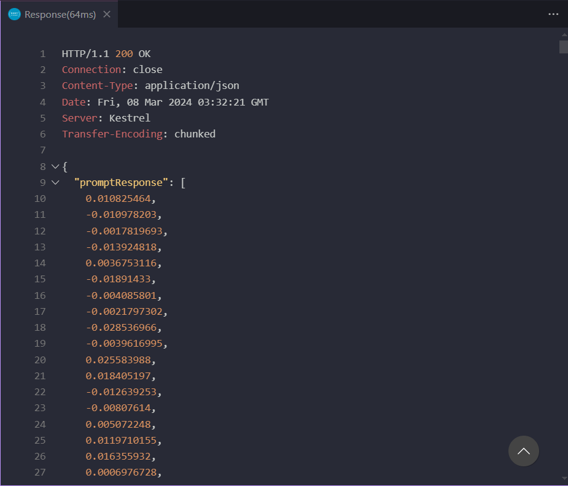

# Session 01: Creating a function with Azure OpenAI, LangChain and Azure Functions

## Overview

In this tutorial, we will create a function that uses Azure OpenAI to answer questions. To do this, we will use the `@langchain/azure-openai` and `langchain` packages. And then, we will use Azure Functions v4 programming model to create the function.

## Install the Azure OpenAI SDK package and LangChain.js

Now that we have the initial structure of the project, let's install the Azure OpenAI SDK package. To do this, type the following command in the terminal:

- `packages/api`

```bash
npm install -S @langchain/azure-openai
```

The package above depends on the installation of `langchain`. If you haven't installed it yet, run the following command:

```bash
npm install -S langchain
```

## Configure access credentials

As we will need to include the access credentials to Azure OpenAI, let's create a `.env` file at the root of the project with the following variables:

```env
AZURE_OPENAI_API_ENDPOINT=""
AZURE_OPENAI_API_EMBEDDING_DEPLOYMENT_NAME=""
AZURE_OPENAI_API_KEY=""
```

**todo: explain what each variable is**

> you can get these credentials in the Azure portal. If you don't have an account, you can create one for free. **[Link](https://learn.microsoft.com/en-us/azure/ai-services/openai/how-to/create-resource?pivots=web-portal)**

We will need to install the `dotenv` package to load the environment variables. Run the following command:

```bash
npm install -S dotenv
```

## Create `Embeddings` with Azure OpenAI

Now that we have the Azure OpenAI SDK package installed and the access credentials configured, open the `functions/chat.ts` file and inside the `chat` function add the following code:

- `packages/api/src/functions/chat.ts`

```typescript
import { HttpRequest, HttpResponseInit, InvocationContext } from '@azure/functions';
import { AzureOpenAIEmbeddings } from '@langchain/azure-openai';
import 'dotenv/config';

export async function chat(request: HttpRequest, context: InvocationContext): Promise<HttpResponseInit> {
  context.log(`Http function processed request for url "${request.url}"`);

  try {
    const requestBody: any = await request.json();

    if (!requestBody?.question) {
      return {
        status: 400,
        jsonBody: {
          error: 'No question provided',
        },
      };
    }

    const { question } = requestBody;

    const embeddings = new AzureOpenAIEmbeddings();

    const prompt = `Question: ${question}`;
    context.log(`Sending prompt to the model: ${prompt}`);

    const promptResponse = await embeddings.embedQuery(prompt);

    if (promptResponse) {
      return {
        status: 200,
        jsonBody: {
          promptResponse,
        },
      };
    } else {
      return {
        status: 503,
        jsonBody: {
          error: 'Service temporarily unavailable. Please try again later.',
        },
      };
    }
  } catch (error: unknown) {
    const err = error as Error;
    context.error(`Error when processing chat request: ${err.message}`);

    return {
      status: 503,
      jsonBody: {
        error: 'Service temporarily unavailable. Please try again later.',
      },
    };
  }
}
```

Let's understand what we did:

1. We import the `AzureOpenAIEmbeddings` class from the `@langchain/azure-openai` package and the `dotenv` package to load the environment variables.

2. As this is a `POST`, we need to check if the request body contains the `question` key. If it does not, we return a 400 error.

3. We instantiate the `AzureOpenAIEmbeddings`, which will allow us to retrieve the environment variables contained in the `.env` file.

4. We create a prompt with the question received in the request. The prompt is a string that contains the question and the keyword `Question:`. This is necessary for the Azure OpenAI model to understand that we are asking a question.

5. Sending the prompt to the Azure OpenAI model and returning the response.

This code will need to be refactored later. But, let's first focus on testing the `chat` function locally.

## Testing the `chat` function

Before testing the `chat` function, let's create a file called `api.http` at the root of the project with the following content:

- `packages/api/api.http`

```http
##################################################################
# VS Code with REST Client extension is needed to use this file.
# Download at: https://aka.ms/vscode/rest-client
##################################################################

@api_host = http://localhost:7071

# Chat with a bot (this is a sample ---> will be change)
POST {{api_host}}/api/chat
Content-Type: application/json

{
  "question": "What is the United States currency?"
}
```

We recommend the `REST Client` extension for Visual Studio Code. With it, you can execute HTTP requests directly from your editor.

Now that we have the code ready, let's test the `chat` function locally. Run the following command:

```bash
npm run start
```

You should see the following message in the terminal:

```bash
Worker process started and initialized.

Functions:

        chat: [POST] http://localhost:7071/api/chat
```

Now open the `api.http` file and click the `Send Request` button that will appear in the upper right corner of the file. You should see the response from the Azure OpenAI model.

If the response appears as shown in the image below, congratulations! We have just created our first function using Azure OpenAI, with LangChain and Azure Functions.



Maybe you wonder: 'Why is `promptResponse` returning an array of numbers?' This happens because `embedQuery` returns an array of numbers. In NPL (Natural Language Processing), these numbers represent the vector representation of the model's response.

**todo: explain better what a vector representation is**

In the next step, we will start creating the use of `CosmosDB LC vector store` to store the vectors generated by Azure OpenAI.

[Next Step: Using CosmosDB LC vector store](./02-session.md)
