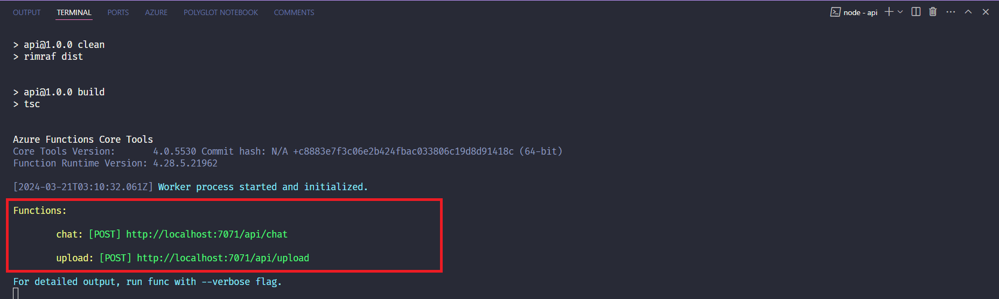
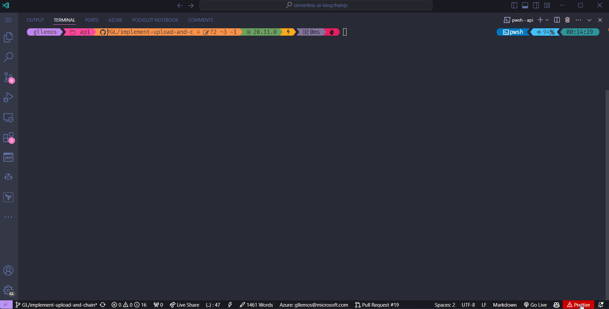

# Session 03: Implement Upload API

Nessa sessão aprenderemos a implementar a API `upload`, que será responsável por receber um arquivo `pdf`, extrairemos o texto usando o `LangChain.js` e salvaremos no `Azure CosmosDB for MongoDB`.

In this session we will learn how to implement the `upload` API, which will be responsible for receiving a `pdf` file, extracting the text using `LangChain.js` and saving it in `Azure CosmosDB for MongoDB`. Let's get started!

## Start to Implement `upload` API

Since we already have `Azure CosmosDB for MongoDB` configured, let's start implementing the `CosmosDB LC Vector Store` in the `upload` API. To do this, open the

- `api/src/functions/upload.ts`

```typescript
import { HttpRequest, HttpResponseInit, InvocationContext } from "@azure/functions";
import { badRequest, ok, serviceUnavailable } from "../utils";

export async function upload(request: HttpRequest, context: InvocationContext): Promise<HttpResponseInit> {
    context.log(`Http function processed request for url "${request.url}"`);

    try {
        const requestFormData = await request.formData();

        if (!requestFormData.has('file')) {
            return badRequest(new Error('"file" field not found in form data.'));
        }

        const file: Blob = requestFormData.get('file') as Blob;

        return ok({ message: 'PDF file uploaded successfully.' });
    } catch (error: unknown) {
        const error_ = error as Error;
        context.error(`Error when processing upload request: ${error_.message}`);
        
        return serviceUnavailable(new Error('Service temporarily unavailable. Please try again later.'))
    }   
};
```

The `requestFormData` variable is an object of type `FormData` which contains the fields sent in the request.

The `has` method checks that the `file` field has been sent in the request. Since it is a `POST` request. If the field is not found, we return a `400 Bad Request` message.

As we are uploading a `pdf` file, we will need to use the **[Blob](https://developer.mozilla.org/en-US/docs/Web/API/Blob)** class so that we can manipulate the file.

The `get` method retrieves the value of the `file` field from the `FormData` object. If the field does not exist, the method returns `null`.

## Load the PDF File

After checking the `file` field, now we need to load the file, read its the content and finally split it. To do this, we will need to use the [pdf-parse](https://www.npmjs.com/package/pdf-parse) package. Let's install it.

```bash
npm install pdf-parse
```

Now, let's implement the code to load the `pdf` file and extract its content.

```typescript
import { HttpRequest, HttpResponseInit, InvocationContext } from "@azure/functions";
import { badRequest, ok, serviceUnavailable } from "../utils";
import { PDFLoader } from "langchain/document_loaders/fs/pdf";
import { RecursiveCharacterTextSplitter } from "langchain/text_splitter";

export async function testUpload(request: HttpRequest, context: InvocationContext): Promise<HttpResponseInit> {
    context.log(`Http function processed request for url "${request.url}"`);

    try {
        const requestFormData = await request.formData();

        if (!requestFormData.has('file')) {
            return badRequest(new Error('"file" field not found in form data.'));
        }

        const file: Blob = requestFormData.get('file') as Blob;

        const loadPDFFile = new PDFLoader(file, {
            splitPages: false,
        });

        const rawPDFFile = await loadPDFFile.load();

        const splitter = new RecursiveCharacterTextSplitter({
            chunkSize: 1000,
            chunkOverlap: 100,
        });

        const pdfFileDocuments = await splitter.splitDocuments(rawPDFFile);

        return ok({ message: 'PDF file uploaded successfully.' });
    } catch (error: unknown) {
        const error_ = error as Error;
        context.error(`Error when processing upload request: ${error_.message}`);
        
        return serviceUnavailable(new Error('Service temporarily unavailable. Please try again later.'))
    }   
};
```

Let's understand what we did here:

We imported the `PDFLoader` and `RecursiveCharacterTextSplitter` classes from the `langchain` package.

The **[PDFLoader](https://api.js.langchain.com/classes/langchain_document_loaders_fs_pdf.PDFLoader.html)** class is responsible for loading documents from PDF files. It can load a PDF file from a file path or a `Blob` object. It can also load a PDF file from a URL. In this case, we are using a `Blob` object.

The **[RecursiveCharacterTextSplitter](https://js.langchain.com/docs/modules/data_connection/document_transformers/recursive_text_splitter)** class is responsible for splitting the text of a document into smaller parts. This is useful for large documents. How does this class do this? It does so using a set of characters. And, the default characters provided are: `["\n\n", "\n", " ", ""]`

It will take a large text and split it by the first character `\n\n`. If the first split is not enough, it will try to split by the character `\n`. And so on. Until the text or the split is smaller than the specified block size.

After that, we created an instance of the `PDFLoader` class passing the `file` document and a configuration object with the `splitPages` property as `false`. Why? Because by default, a document will be created for each page of the PDF file. That's why we are disabling this option.

Then, we loaded the PDF file using the `load` method of the `PDFLoader` class instance.

We create an instance of the `RecursiveCharacterTextSplitter` class by passing a configuration object with the `chunkSize` and `chunkOverlap` properties.  

The `chunkSize` controls the maximum size (in terms of number of characters) of the final documents. And, the `chunkOverlap` will specify how much overlap there should be between the chunks. This is useful to ensure that the text is not split inappropriately. Usually the default is `1000` and `200`, respectively.

Finally, we divided the PDF document into smaller parts using the **[splitDocuments](https://api.js.langchain.com/classes/langchain_text_splitter.RecursiveCharacterTextSplitter.html#splitDocuments)** method of the `RecursiveCharacterTextSplitter` class instance. The method returns an array of documents.

## Save the PDF File in CosmosDB

Now that we have the PDF file divided into smaller parts, we can save it in `Azure CosmosDB for MongoDB`. Let's implement the code to do this.

```typescript
import { HttpRequest, HttpResponseInit, InvocationContext } from '@azure/functions';
import { AzureOpenAIEmbeddings } from '@langchain/azure-openai';
import { badRequest, serviceUnavailable, ok } from '../utils';
import { PDFLoader } from "langchain/document_loaders/fs/pdf";
import 'dotenv/config';
import { RecursiveCharacterTextSplitter } from 'langchain/text_splitter';
import {
  AzureCosmosDBVectorStore,
  AzureCosmosDBSimilarityType,
} from "@langchain/community/vectorstores/azure_cosmosdb";


export async function upload(request: HttpRequest, context: InvocationContext): Promise<HttpResponseInit> {
  try {
    const parsedForm = await request.formData();

    if (!parsedForm.has('file')) {
      return badRequest(new Error('"file" field not found in form data.'));
    }

    const file: Blob = parsedForm.get('file') as Blob;

    const loadPDFFile = new PDFLoader(file, {
      splitPages: false,
    });

    const rawPDFFile = await loadPDFFile.load();

    const splitter = new RecursiveCharacterTextSplitter({
      chunkSize: 1000,
      chunkOverlap: 100,
    });

    const pdfFileDocuments = await splitter.splitDocuments(rawPDFFile);

    const store = await AzureCosmosDBVectorStore.fromDocuments(
      pdfFileDocuments,
      new AzureOpenAIEmbeddings(),
      {
        databaseName: "langchain-database",
        collectionName: "pdfs"
      }
    );

    const numLists = 100;
    const dimensions = 1536;
    const similarity = AzureCosmosDBSimilarityType.COS;
    await store.createIndex(numLists, dimensions, similarity);

    await store.close();

    return ok({ message: 'PDF file uploaded successfully.' });
  } catch (error: unknown) {
    const error_ = error as Error;
    context.error(`Error when processing chat request: ${error_.message}`);

    return serviceUnavailable(new Error('Service temporarily unavailable. Please try again later.'));
  }
};
```

Let's understand what we did here:

We imported the `AzureCosmosDBVectorStore` and `AzureCosmosDBSimilarityType` classes from the `langchain` package.

The `AzureCosmosDBVectorStore` class is responsible for storing and retrieving vectors from `Azure CosmosDB for MongoDB`. It can be used to store and retrieve vectors from a collection in a database. It can also be used to create an index in the collection. 

Then we created an instance of the `AzureCosmosDBVectorStore` class by passing the `pdfFileDocuments` array using the method `fromDocuments`. This method is responsible for creating an instance of the `AzureCosmosDBVectorStore` from a list of documents. It first converts the documents to vectors and then adds them to the collection.

We created an instance of the `AzureOpenAIEmbeddings`, at this point this class will grab the `Azure OpenAI` credentials from the environment variables. Then we passed a configuration object with the `databaseName` and `collectionName` properties.

Then we created three variables:

- `numLists`: which controls the number of lists to be used in the index.
- `dimensions`: which controls the number of dimensions of the vectors. The maximum number of dimensions supported is `2000`
- `similarity`: similarity metric to be used when creating the index. In this case, we can use `COS` (cosine distance), `L2` (Euclidean distance) and `IP` (inner product). In this case, we are using the `COS` algorithm.

Thereafter use the `createIndex` method, which is responsible for creating an index in the collection with the name of the index specified during the construction of the instance. This method is precisely waiting for the `numLists`, `dimensions` and `similarity` parameters that we have just defined.

Finally, we closed the store using the `close` method of the `AzureCosmosDBVectorStore` class instance. 

If you want to learn more about Azure CosmosDB for MongoDB vCore in vector use cases, you can access the **[official documentation](https://learn.microsoft.com/en-us/azure/cosmos-db/mongodb/vcore/vector-search)**.

Phew! We have implemented the `upload` API. Now let's test it.

## Test the `upload` API

To test the `upload` API, let's use Visual Studio Code's own terminal. To do this, run the command inside the `api` folder:

- `packages/api`
  
```bash
npm run start
```

The following message will appear, as shown in the image below:



Now let's use a new terminal to make the `POST` request to the `upload` API. To do this, run the following command:

```bash
curl -F "file=@data/support.pdf" http://localhost:7071/api/upload
```

Note that we are using the file that needs to be sent to the `upload` API that we defined in the code as `file`.

If everything goes well, you will see the following message:

```json
{
  "message": "PDF file uploaded successfully."
}
```

Watch the gif of the whole process being executed:



Great! We have finished implementing the `upload` API. Now, let's finish implementing chain in the `chat` API.

▶ **[Next Step: Generate completion using `chain` in the `chat` API](./04-session.md)**


