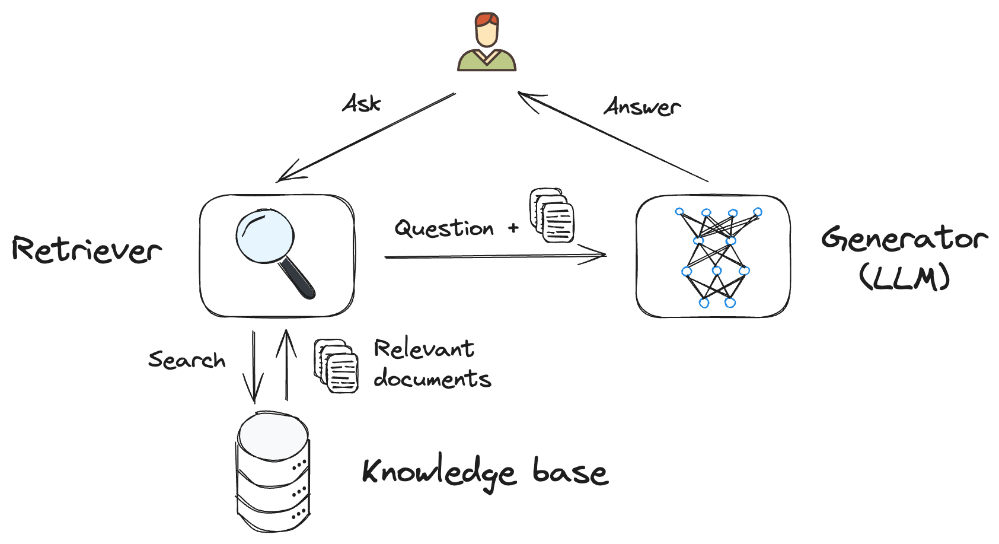

## Frequently Asked Questions

<details>
<summary><b>What is <em>Retrieval-Augmented Generation</em>?</b></summary><br>

Retrieval-Augmented Generation (RAG) is a method used in artificial intelligence, particularly in natural language processing, to generate text responses that are both contextually relevant and rich in content using AI models.

At its core, RAG involves two main components:

- **Retriever**: Think "_like a search engine_", finding relevant information from a knowledgebase, usually a vector database. In this sample, we're using Azure Cosmos DB for NoSQL as our vector database.

- **Generator**: Acts like a writer, taking the prompt and information retrieved to create a response. We're using here a Large Language Model (LLM) for this task.

<div align="center">
  
</div>

</details>

<details>
<summary><b>How can we upload additional documents without redeploying everything?</b></summary><br>

To upload more documents, first put your PDF document in the `data/` folder, then use one of these commands depending on your environment.

### For local development

Make sure your API is started by running `npm run start:api` from the root of the project. Then you can use one of the following commands to upload a new PDF document:

```bash
# If you're using a POSIX shell
curl -F "file=@data/<your-document.pdf>" http://localhost:7071/api/documents

# If you're using PowerShell
Invoke-RestMethod -Uri "http://localhost:7071/api/documents" -Method Post -InFile "./data/<your-document.pdf>"
```

You can also use the following command to reupload all PDFs file in the `/data` folder at once:

```bash
npm run upload:docs
```

### For the deployed version

First you need to find the URL of the deployed function. You can either look at the `packages/api/.env` file and search for the `API_URI` variable, or run this command to get the URL:

```bash
azd env get-values | grep API_URI
```

Then you can use the one of the following commands to upload a new PDF document:

```bash
# If you're using a POSIX shell
curl -F "file=@data/<your-document.pdf>" <your_api_url>/api/documents

# If you're using PowerShell
Invoke-RestMethod -Uri "<your_api_url>/api/documents" -Method Post -InFile "./data/<your-document.pdf>"
```

You can also use the following command to reupload all PDFs file in the `/data` folder at once:

```bash
node scripts/upload-documents.js <your_api_url>
```

</details>

<details>
<summary><b>Why do we need to break up the documents into chunks?</b></summary><br>

Chunking allows us to limit the amount of information we send to the LLM due to token limits. By breaking up the content, it allows us to easily find potential chunks of text that we can inject and improve the relevance of the results. The method of chunking we use leverages a sliding window of text such that sentences that end one chunk will start the next. This allows us to reduce the chance of losing the context of the text.

</details>

<details>
<summary><b>How do you change the models used in this sample?</b></summary><br>

You can use the environment variables to change the chat and embeddings models used in this sample when deployed.
Run these commands:

```bash
azd env set AZURE_OPENAI_API_MODEL gpt-4
azd env set AZURE_OPENAI_API_MODEL_VERSION  0125-preview
azd env set AZURE_OPENAI_API_EMBEDDINGS_MODEL text-embedding-3-large
azd env set AZURE_OPENAI_API_EMBEDDINGS_MODEL_VERSION 1
```

You may also need to adjust the capacity in `infra/main.bicep` file, depending on how much TPM your account is allowed.

### Local models

To change the local models used by Ollama, you can edit the file `packages/api/src/constants.ts`:

```typescript
export const ollamaEmbeddingsModel = 'nomic-embed-text:latest';
export const ollamaChatModel = 'llama3.1:latest';
```

You can see the complete list of available models at https://ollama.ai/models.

After changing the models, you also need to fetch the new models by running the command:

```bash
ollama pull <model-name>
```

</details>

<details>
<summary><b>What does the <code>azd up</code> command do?</b></summary><br>

The `azd up` command comes from the [Azure Developer CLI](https://learn.microsoft.com/azure/developer/azure-developer-cli/overview), and takes care of both provisioning the Azure resources and deploying code to the selected Azure hosts.

The `azd up` command uses the `azure.yaml` file combined with the infrastructure-as-code `.bicep` files in the `infra/` folder. The `azure.yaml` file for this project declares several "hooks" for the prepackage step and postprovision steps. The `up` command first runs the `prepackage` hook which installs Node dependencies and builds the TypeScript files. It then packages all the code (both frontend and backend services) into a zip file which it will deploy later.

Next, it provisions the resources based on `main.bicep` and `main.parameters.json`. At that point, since there is no default value for the OpenAI resource location, it asks you to pick a location from a short list of available regions. Then it will send requests to Azure to provision all the required resources. With everything provisioned, it runs the `postprovision` hook to process the local data and add it to an Azure Cosmos DB index.

Finally, it looks at `azure.yaml` to determine the Azure host (Functions and Static Web Apps, in this case) and uploads the zip to Azure. The `azd up` command is now complete, but it may take some time for the app to be fully available and working after the initial deploy.

Related commands are `azd provision` for just provisioning (if infra files change) and `azd deploy` for just deploying updated app code.

</details>

<details>
<summary><b>Why using Azure Cosmos DB for vector search? What about Azure AI Search?</b></summary><br>

There are multiple Azure services that implement vector search capabilities, including Azure Cosmos DB. In this sample, we use Azure Cosmos DB for vector search because it's also a regular NoSQL database that can store any of your regular data workloads in addition to the vector search data. This makes it a versatile choice for a wide range of applications, all while keeping costs low by using a serverless tier.

Azure AI Search is another option for vector search, but it's more focused on search capabilities: it provides more advanced vector search and hybrid search options, though it doesn't provide the same flexibility as Azure Cosmos DB. We also have a version of this sample that uses Azure AI Search, which you can find [here](https://github.com/Azure-Samples/serverless-chat-langchainjs/tree/ai-search).

For more information about Azure vector search options, you can check out [this architecture guide](https://learn.microsoft.com/azure/architecture/guide/technology-choices/vector-search).

</details>

<!-- TODO: implement this in the code
<details>
<summary><b>I don't have access to Azure OpenAI, can I use the regular OpenAI API?</b></summary><br>

Yes! You can use the regular OpenAI API by setting the `OPENAI_URL` and the `OPENAI_KEY` environment variables. You can do this by running the following commands:

```bash
azd env set OPENAI_URL https://api.openai.com/v1/chat/completions
azd env set OPENAI_KEY <your-openai-api-key>
```

After setting these environment variables, you can run the `azd up` command to deploy the app.

</details> -->
