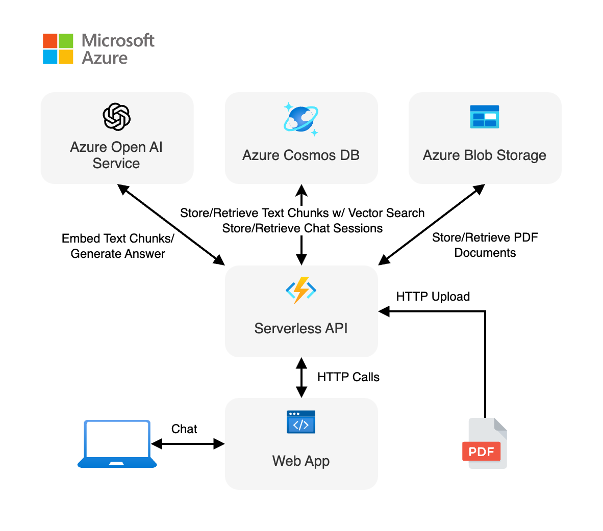

<!-- Learn samples onboarding: https://review.learn.microsoft.com/en-us/help/contribute/samples/process/onboarding?branch=main -->
<!-- prettier-ignore -->
This sample shows how to build a serverless AI chat experience with Retrieval-Augmented Generation using [LangChain.js](https://js.langchain.com/) and Azure. The application is hosted on [Azure Static Web Apps](https://learn.microsoft.com/azure/static-web-apps/overview) and [Azure Functions](https://learn.microsoft.com/azure/azure-functions/functions-overview?pivots=programming-language-javascript), with [Azure Cosmos DB for NoSQL](https://learn.microsoft.com/azure/cosmos-db/nosql/vector-search) as the vector database. You can use it as a starting point for building more complex AI applications.

## Overview

Building AI applications can be complex and time-consuming, but using LangChain.js and Azure serverless technologies allows to greatly simplify the process. This application is a chatbot that uses a set of enterprise documents to generate responses to user queries.

We provide sample data to make this sample ready to try, but feel free to replace it with your own. We use a fictitious company called _Contoso Real Estate_, and the experience allows its customers to ask support questions about the usage of its products. The sample data includes a set of documents that describes its terms of service, privacy policy and a support guide.

This application is made from multiple components:

- A web app made with a single chat web component built with [Lit](https://lit.dev) and hosted on [Azure Static Web Apps](https://learn.microsoft.com/azure/static-web-apps/overview). The code is located in the `packages/webapp` folder.

- A serverless API built with [Azure Functions](https://learn.microsoft.com/azure/azure-functions/functions-overview?pivots=programming-language-javascript) and using [LangChain.js](https://js.langchain.com/) to ingest the documents and generate responses to the user chat queries. The code is located in the `packages/api` folder.

- A database to store chat sessions and the text extracted from the documents and the vectors generated by LangChain.js, using [Azure Cosmos DB for NoSQL](https://learn.microsoft.com/azure/cosmos-db/nosql/).

- A file storage to store the source documents, using [Azure Blob Storage](https://learn.microsoft.com/azure/storage/blobs/storage-blobs-introduction).

## Prerequisites

- [Node.js LTS](https://nodejs.org/download/)
- [Azure Developer CLI](https://aka.ms/azure-dev/install)
- [Git](https://git-scm.com/downloads)
- Azure account. If you're new to Azure, [get an Azure account for free](https://azure.microsoft.com/free) to get free Azure credits to get started. If you're a student, you can also get free credits with [Azure for Students](https://aka.ms/azureforstudents).
- Azure subscription with access enabled for the Azure OpenAI service. You can request access with [this form](https://aka.ms/oaiapply).
- Azure account permissions:
  - Your Azure account must have `Microsoft.Authorization/roleAssignments/write` permissions, such as [Role Based Access Control Administrator](https://learn.microsoft.com/azure/role-based-access-control/built-in-roles#role-based-access-control-administrator-preview), [User Access Administrator](https://learn.microsoft.com/azure/role-based-access-control/built-in-roles#user-access-administrator), or [Owner](https://learn.microsoft.com/azure/role-based-access-control/built-in-roles#owner). If you don't have subscription-level permissions, you must be granted [RBAC](https://learn.microsoft.com/azure/role-based-access-control/built-in-roles#role-based-access-control-administrator-preview) for an existing resource group and [deploy to that existing group](docs/deploy_existing.md#resource-group).
  - Your Azure account also needs `Microsoft.Resources/deployments/write` permissions on the subscription level.

## Setup the sample

You can run this project directly in your browser by using GitHub Codespaces, which will open a web-based VS Code.

1. [**Fork**](https://github.com/Azure-Samples/serverless-chat-langchainjs/fork) the project to create your own copy of this repository.
2. On your forked repository, select the **Code** button, then the **Codespaces** tab, and clink on the button **Create codespace on main**.
   
3. Wait for the Codespace to be created, it should take a few minutes.

## Deploy on Azure

1. Open a terminal at the root of the project.
2. Authenticate with Azure by running `azd auth login`.
3. Run `azd up` to deploy the application to Azure. This will provision Azure resources, deploy this sample, and build the search index based on the files found in the `./data` folder.
   - You will be prompted to select a base location for the resources. If you're unsure of which location to choose, select `eastus2`.
   - By default, the OpenAI resource will be deployed to `eastus2`. You can set a different location with `azd env set AZURE_OPENAI_RESOURCE_GROUP_LOCATION <location>`. Currently only a short list of locations is accepted. That location list is based on the [OpenAI model availability table](https://learn.microsoft.com/azure/ai-services/openai/concepts/models#standard-deployment-model-availability) and may become outdated as availability changes.

The deployment process will take a few minutes. Once it's done, you'll see the URL of the web app in the terminal.

You can now open the web app in your browser and start chatting with the bot.

## Enable CI/CD (Optional)

If you want to enable Continuous Deployment for your forked repository, you need to configure the Azure pipeline first:

1. Open a terminal at the root of your forked project.
2. Authenticate with Azure by running `azd auth login`.
3. Run `azd pipeline config` to configure the required secrets and variables for connecting to Azure from GitHub Actions.
   - This command will set up the necessary Azure service principal and configure GitHub repository secrets.
   - Follow the prompts to complete the configuration.

Once configured, the GitHub Actions workflow will automatically deploy your application to Azure whenever you push changes to the main branch.

## Key concepts

Our API is composed of two main endpoints:

- `POST /documents`: This endpoint allows to upload a PDF documents in the database. Using LangChain.js, we extract the text from the PDF file, split it into smaller chunks, and generate vectors for each chunk. We store the text and the vectors in the database for later use.

- `POST /chats`: This endpoint receives a list of messages, the last being the user query and returns a response generated by the LLM. It uses the documents stored in the database to generate the response. We use LangChain.js components to connect to the database, load the documents and perform a vector search after vectorizing the user query. After that, the most relevant documents are injected into the prompt, and we generate the response. While this process seems complex, LangChain.js does all the heavy lifting for us so we can focus on the application flow.

The `/documents` endpoint is used to ingest the documents after the application is deployed by uploading the PDFs, using either `curl` commands or the Node.js script we built (have a look at the `postup` hook in the `azure.yaml` file).

The web app is a simple chat interface that sends the user queries to the `/chat` endpoint and displays the responses.
We use the [HTTP protocol for AI chat apps](https://aka.ms/chatprotocol) to communicate between the web app and the API.

## Clean up

To clean up all the Azure resources created by this sample:

1. Run `azd down --purge`
2. When asked if you are sure you want to continue, enter `y`

The resource group and all the resources will be deleted.

## Troubleshooting

If you have any issue when running or deploying this sample, please check the [troubleshooting guide](./troubleshooting.md). If you can't find a solution to your problem, please [open an issue](https://github.com/Azure-Samples/serverless-chat-langchainjs/issues) in this repository.

## Next steps

Here are some resources to learn more about the technologies used in this sample:

- [LangChain.js documentation](https://js.langchain.com)
- [Generative AI with JavaScript](https://github.com/microsoft/generative-ai-with-javascript)
- [Generative AI For Beginners](https://github.com/microsoft/generative-ai-for-beginners)
- [Azure OpenAI Service](https://learn.microsoft.com/azure/ai-services/openai/overview)
- [Azure Cosmos DB for NoSQL](https://learn.microsoft.com/azure/cosmos-db/nosql/)
- [Ask YouTube: LangChain.js + Azure Quickstart sample](https://github.com/Azure-Samples/langchainjs-quickstart-demo)
- [Chat + Enterprise data with Azure OpenAI and Azure AI Search](https://github.com/Azure-Samples/azure-search-openai-javascript)
- [Revolutionize your Enterprise Data with Chat: Next-gen Apps w/ Azure OpenAI and AI Search](https://aka.ms/entgptsearchblog)

You can also find [more Azure AI samples here](https://github.com/Azure-Samples/azureai-samples).
