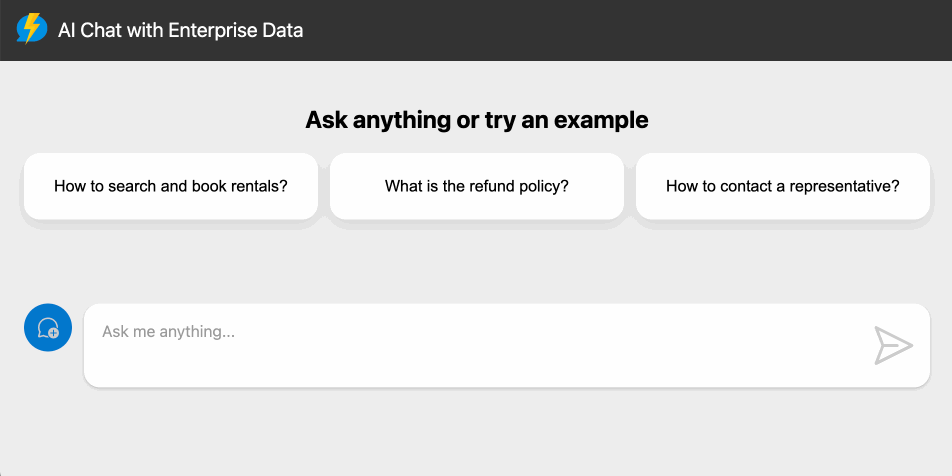

# Tutorial - Create a Serverless AI Chat with RAG using LangChain.js and TypeScript

Welcome to the tutorial _Create a Serverless AI Chat with RAG using LangChain.js and TypeScript_.

This tutorial will guide you through creating a serverless a AI Chat and RAG (Retrieval-Augmented Generation) application using LangChain.js, Azure Functions, Azure Cosmos DB for MongoDB vCore, Azure Blob Storage, and Azure Static Web Apps.

The chatbot you're building can answer questions based on a set of enterprise documents uploaded from a fictional company called _Contoso Real Estate_.

Here's an example of the application in action:



This tutorial will teach you how to build a serverless application using Azure Functions and LangChain.js.

LangChain.js is a library used for building AI apps. It integrates LLMs, large language models like GPT, Claude-2 and more. It also makes it easy to develop AI-driven chatbots. Next, you'll learn how to set up the environment and deploy the application.

The front end of the application is provided so that you can focus on the backend code and technologies.

## Prerequisites

You can run the application in the tutorial using one of the following options:

- Run the application locally on your machine.
- Run the application using Codespaces.

### Run using Codespaces

> It is highly recommended to use Codespaces for this tutorial. Codespaces is a cloud-based tool that enables you to run development environments without installing any tools on your computer. This way, you can focus on the development process without worrying about the environment setup.

If you decide to continue using **[Codespaces](https://github.com/features/codespaces)**, you can follow the steps described in the README.md file at the root of the project.

> **Note**: If you are using Codespaces, you don't need to install any of the prerequisites mentioned above. Codespaces already has all the necessary tools installed. Codespaces can be used for free for up to 60 hours per month, and this is renewed every month.

### Run Locally

If you choose to use a local environment, you'll need to install:

- [Node.js](https://nodejs.org/en/download/)
- [TypeScript](https://www.typescriptlang.org/download)
- [Visual Studio Code](https://code.visualstudio.com/download)
- [Azure Functions Core Tools](https://docs.microsoft.com/en-us/azure/azure-functions/functions-run-local?tabs=windows%2Ccsharp%2Cbash)
- [Git](https://git-scm.com/downloads)
- [Azure Developer CLI](https://docs.microsoft.com/en-us/cli/azure/install-azure-cli)

> If you are a Windows user, you'll need to install [PowerShell](https://learn.microsoft.com/powershell/scripting/install/installing-powershell-on-windows?view=powershell-7.4), [Git Bash](https://git-scm.com/downloads) or [WSL2](https://learn.microsoft.com/windows/wsl/install) to run the bash commands.

## Project Overview

Building AI applications can be complex and time-consuming. By using LangChain.js and Azure Functions including Serverless technologies, you can greatly simplify the process. These tools streamline the development by managing infrastructure concerns and scaling automatically, allowing you to focus more on building the chatbot functionality and less on the underlying system architecture. This application is a chatbot that uses a set of enterprise documents to generate AI responses to user queries.

The code sample includes sample data to make trying the application quick and easy, but feel free to replace it with your own. You'll use a fictitious company called Contoso Real Estate, and the experience allows its customers to ask support questions about the usage of the company's products. The sample data includes a set of documents that describes the company's terms of service, privacy policy, and support guide.

## Understanding the project architecture

The architecture of the project is shown in the following diagram:


To understand the architecture of the project, let's break it down into its individual components:

1. **Web App:**

   - The user interface for the chatbot is a web application built with **[Lit](https://lit.dev/)** (a library for building web components) and hosted using **[Azure Static Web Apps](https://learn.microsoft.com/azure/static-web-apps/overview)**. It provides a chat interface for users they can use to ask questions.
   - The code is in the `packages/webapp` folder.

2. **Serverless API:**

   - When a user sends a query through the web app, it is sent via HTTP to an API built using Azure Functions.
   - The API uses LangChain.js to process the query.
   - The API manages the logic of corporate documents and responds with answers to chat queries.
   - The code for this functionality will be shown later in the tutorial and is in the `packages/api` folder.

3. **Database:**

   - Text extracted from the documents and the vectors generated by LangChain.js is stored in Azure Cosmos DB for MongoDB vCore.
   - The database allows for the storage and retrieval of text chunks using vector search, which enables quick and relevant responses based on the user's queries.

4. **File Storage:**

   - The source documents such as terms of service, privacy policy, and support guides for the Contoso Real Estate are stored in Azure Blob Storage. This is where the PDF documents are uploaded and retrieved from.

5. **Azure OpenAI Service:**

   - This service is where the AI Model (a Large Language Model or LLM) is hosted. The model can understand and generate natural language. This is used to embed text chunks or generate answers based on the vector search from the database.

Let's examine the application flow based on the architecture diagram:

- A user interacts with the chat interface in the web app
- The web app sends the user's query to the Serverless API via HTTP calls
- The Serverless API interacts with Azure OpenAI Service to generate a response, using the data from Azure Cosmos DB for MongoDB vCore.
- If there's a need to reference the documents, Azure Blob Storage is used to retrieve the PDF documents.
- The generated response is then sent back to the web app and displayed to the user.

The architecture is based on the RAG (Retrieval-Augmented Generation) architecture. This architecture combines the ability to retrieve information from a database with the ability to generate text from a language model. You'll learn more about RAG later in the tutorial.

## Executing the Project

Now that you understand the project's architecture, let's run it!

Once you have `forked` and `cloned` the project, use the `starter` branch to continue with the tutorial. The `main` branch has the finished project if you wish to view it!

To execute the project, follow these steps:

1. Install the project dependencies:

```bash
npm install
```

2. To run the project, with only Front-end, execute the following command:

```bash
npm run start:webapp
```

> At this point, do not worry about the other scripts in the `package.json` file at the root of the project. They will be used throughout the tutorial.

3. Open your browser and go to `http://localhost:8000`. The application will be displayed, as shown in the image below:


## Next Steps

Here are some additional resources for you to delve into:

- **[Azure Functions Documentation](https://learn.microsoft.com/azure/azure-functions/)**
- **[Azure Cosmos DB for MongoDB vCore Documentation](https://learn.microsoft.com/azure/cosmos-db/mongodb/vcore/)**
- **[Azure Blob Storage Documentation](https://learn.microsoft.com/azure/storage/blobs/)**
- **[Azure Static Web Apps Documentation](https://learn.microsoft.com/azure/static-web-apps/)**
- **[LangChain.js Documentation](https://js.langchain.com/docs/get_started/introduction)**
- **[OpenAI API Documentation](https://platform.openai.com/docs/introduction)**
- **[Lit Documentation](https://lit.dev/)**
- **[TypeScript Documentation](https://www.typescriptlang.org/docs/)**
- **[Node.js Documentation](https://nodejs.org/en/docs/)**
- **[Visual Studio Code Documentation](https://code.visualstudio.com/docs)**
- **[Git Documentation](https://git-scm.com/doc)**
- **[Azure Developer CLI Documentation](https://docs.microsoft.com/en-us/cli/azure/install-azure-cli)**
- **[PowerShell Documentation](https://learn.microsoft.com/powershell/scripting/install/installing-powershell-on-windows?view=powershell-7.4)**

In the next section, we will start to create the API using Azure Functions. See you there!

**[Next Step: Setting Up the Serverless Environment using Azure Functions ➡️](./02-setting-up-azure-functions.md)**
