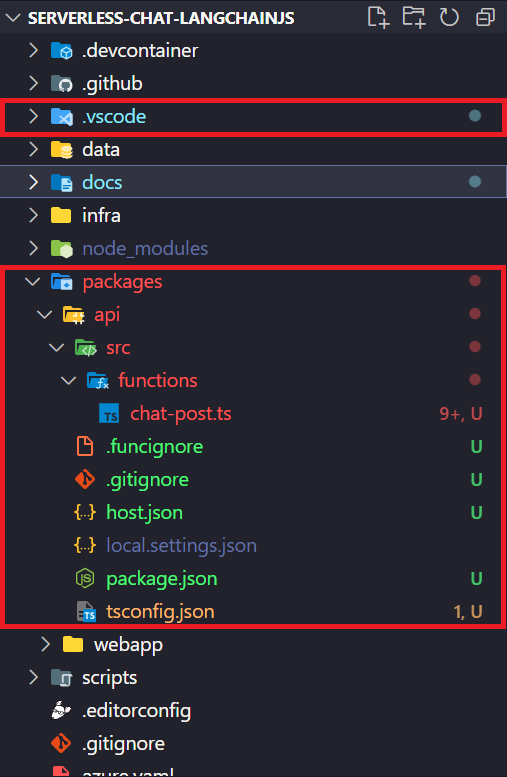
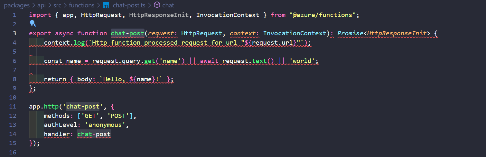
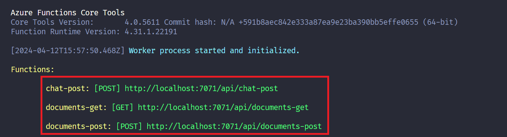

# Setting Up the Serverless Environment using Azure Functions

This section explains how to configure the development environment to create the API for the AI Chat. We'll use Azure Functions in its 4.x version and with the programming model version 4.

## Prerequisites for this section

At this point, do not forget to install **[Azure Functions Core Tools](https://docs.microsoft.com/azure/azure-functions/functions-run-local?tabs=windows%2Ccsharp%2Cbash)** if you are developing locally on your machine. If you are using **[Codespaces](https://github.com/features/codespaces)**, the environment will already be set up for you!

To make it easier to create new functions and project configurations, we recommend installing the **[Azure Functions extension for Visual Studio Code extension](https://marketplace.visualstudio.com/items?itemName=ms-azuretools.vscode-azurefunctions)**.

## What are Azure Functions?

**[Azure Functions](https://learn.microsoft.com/azure/azure-functions/functions-overview?pivots=programming-language-javascript)** is a **[serverless computing service](https://azure.microsoft.com/resources/cloud-computing-dictionary/what-is-serverless-computing)**. It allows us to run code on demand without requiring a server infrastructure. You can execute your code in response to many events, including data changes, message triggers, HTTP calls, and even timers.

## What are Azure Functions v4 programming model for Node?

Azure Functions v4 is the latest version of the Node.js programming model for Azure Functions. It comes with a bunch of new features and improvements, such as:

- Flexible folder structure
- Being able to define `function.json` directly in the code.
- New HTTP trigger types
- Improved IntelliSense
- Timer Trigger (TypeScript)
- Durable Functions (TypeScript)

> **Note:** if you are using version 3.x of the Azure Functions programming model for Node.js, we recommend referring to the **[official documentation](https://learn.microsoft.com/en-us/azure/azure-functions/functions-node-upgrade-v4?tabs=v4&pivots=programming-language-typescript)** for guidance on the project structure and how to define functions in case if you want to migrate to version 4.x.

> **Tip:** to learn about the latest version of the Azure Functions programming model v4 for Node.js, read the **[official blog post](https://techcommunity.microsoft.com/t5/apps-on-azure-blog/azure-functions-node-js-v4-programming-model-is-generally/ba-p/3929217)**

## Creating a new Azure Functions project

After following the steps above and forking the repository in the `starter` branch, you should take the following steps:

| Step | Description                                                                                                                                                                                     |
| ---- | ----------------------------------------------------------------------------------------------------------------------------------------------------------------------------------------------- |
| 1    | Open the `packages` folder and create a new folder called `api`.                                                                                                                                |
| 2    | To use the Azure Functions extension in Visual Studio Code, press `Ctrl + Shift + P` (for Windows users) or `Cmd + Shift + P` (for Mac users) and type `Azure Functions: Create New Project...` |
| 3    | Select the `api` folder we just created and click `Select`.                                                                                                                                     |
| 4    | Select the programming language `TypeScript`.                                                                                                                                                   |
| 5    | Select a TypeScript programming model `Model V4`.                                                                                                                                               |
| 6    | Select a template for your project's first function `HTTP trigger`.                                                                                                                             |
| 7    | Enter a name for the function `chat-post`.                                                                                                                                                      |

After creating the project, you will see a similar folder and file structure:



> **Note:** when we create a new project, it may take some time to install all the project dependencies and structure. Wait until the process is complete.

Note that the project structure differs significantly from the programming model 3.x version. Let's take a moment to understand the structure of this new programming model version:

- **src folder:** has all the project logic, including functions and configuration files.
- **functions folder:** has the functions related to the project.

- `local.settings.json`: local configuration file to store environment settings.
- `host.json`: Azure Functions host configuration file.
- `tsconfig.json`: TypeScript configuration file.
- `package.json`: Node.js configuration file.
- `.funcignore`: file to ignore files and folders when publishing the project.

This new structure is more flexible and allows us to define functions directly in the code, without the need for a separate `function.json` file as was needed in version 3.x. It is like Express.js, a web framework for Node.js.

In addition to the project structure created, note that another folder called `.vscode` was automatically created. This folder has the Visual Studio Code configurations for the project, such as building and debug tasks. Next, we need to configure the project so that we can run the function created.

## Setting up the project to run the functions

The project is not fully configured to run yet. There are signs that TypeScript is telling us that something is wrong, and we need to fix it.

Open the `tsconfig.json` file and add the following configuration:

- `packages/api/tsconfig.json`

```json
{
  "compilerOptions": {
    "module": "CommonJS",
    "target": "ESNext",
    "incremental": true,
    "composite": true,
    "skipLibCheck": true,
    "forceConsistentCasingInFileNames": true,
    "outDir": "dist",
    "rootDir": ".",
    "sourceMap": true,
    "strict": true,
    "moduleResolution": "node",
    "esModuleInterop": true,
    "lib": ["ESNext"]
  }
}
```

Before executing the function, we've created, we need to make some important changes. Open the `.vscode` folder and the `settings.json` file, and add the following configuration:

- `.vscode/settings.json`

```json
{
  "azureFunctions.deploySubpath": "packages/api",
  "azureFunctions.postDeployTask": "npm install (functions)",
  "azureFunctions.projectLanguage": "TypeScript",
  "azureFunctions.projectRuntime": "~4",
  "debug.internalConsoleOptions": "neverOpen",
  "azureFunctions.projectLanguageModel": 4,
  "azureFunctions.projectSubpath": "packages/api",
  "azureFunctions.preDeployTask": "npm prune (functions)"
}
```

This configuration is important so that we can run the functions created in the project.

Now the last configuration we need to make is in the file `src/functions/chat-post`. Note that, when you open the file, there are some compilation errors.



Why? Because we cannot define a function in the same way as `chat-post` was created. We need to change it to `postChat` without the hyphen. Additionally, we need to modify the handler of the `chat-post` function to `postChat` and also, specify that this function will be a `POST` instead of a `GET` function.

So, the `chat-post` function will look like this:

- `packages/src/functions/chat-post.ts`

```typescript
import { app, HttpRequest, HttpResponseInit, InvocationContext } from '@azure/functions';

export async function postChat(request: HttpRequest, context: InvocationContext): Promise<HttpResponseInit> {
  context.log(`Http function processed request for url "${request.url}"`);

  const name = request.query.get('name') || (await request.text()) || 'world';

  return { body: `Hello, ${name}! POST Chat Function` };
}

app.http('chat-post', {
  methods: ['POST'],
  authLevel: 'anonymous',
  handler: postChat,
});
```

To check if everything is working properly, open the Visual Studio Code terminal and go to the `packages/api` folder and run the command `npm start`. If everything is correct, you will see the following message:

- Local: http://localhost:7071/api/chat-post

```bash
Http Functions:

        chat-post: [POST] http://localhost:7071/api/chat-post
```

> **Note:** if you are using Codespaces, the URL port may be different. access the URL provided in the Codespaces terminal.

Open the browser and go to the URL `http://localhost:7071/api/chat-post`. You will see the following message:

```bash
Hello, world! POST Chat Function
```

If this happens, congratulations! We have successfully set up the environment correctly!

## Creating the other functions for the project

Let's create the other functions we will use throughout this project. We are going to create two more functions. They are:

- `documents-post`
- `documents-get`

We can easily create these functions by using the Azure Functions extension in Visual Studio Code. Simply follow the steps below:

1.  Press `Ctrl + Shift + P` (for Windows users) or `Cmd + Shift + P` (for Mac users) and type `Azure Functions: Create Function...`.
2.  Select a template for your function `HTTP trigger`

3.  Provide a function name `documents-post`

Repeat the same process for the `documents-get` function.

We need to make the same changes to the `documents-post` and `documents-get` functions, just as we did with the `chat-post` function.

- `packages/src/functions/documents-post.ts`

```typescript
import { app, HttpRequest, HttpResponseInit, InvocationContext } from '@azure/functions';

export async function postDocuments(request: HttpRequest, context: InvocationContext): Promise<HttpResponseInit> {
  context.log(`Http function processed request for url "${request.url}"`);

  const name = request.query.get('name') || (await request.text()) || 'world';

  return { body: `Hello, ${name}! POST Documents Function` };
}

app.http('documents-post', {
  methods: ['POST'],
  authLevel: 'anonymous',
  handler: postDocuments,
});
```

- `packages/src/functions/documents-get.ts`

```typescript
import { app, HttpRequest, HttpResponseInit, InvocationContext } from '@azure/functions';

export async function getDocument(request: HttpRequest, context: InvocationContext): Promise<HttpResponseInit> {
  context.log(`Http function processed request for url "${request.url}"`);

  const name = request.query.get('name') || (await request.text()) || 'world';

  return { body: `Hello, ${name}! GET Documents Function` };
}

app.http('documents-get', {
  methods: ['GET'],
  authLevel: 'anonymous',
  handler: getDocument,
});
```

Now, open the Visual Studio Code terminal again and go to the `packages/api` folder and run the command `npm start`. If everything is correct, you will see the following message:

```bash
Http Functions:

        chat-post: [POST] http://localhost:7071/api/chat-post
        documents-post: [POST] http://localhost:7071/api/documents-post
        documents-get: [GET] http://localhost:7071/api/documents-get
```

Open your browser and access the url `http://localhost:7071/api/documents-post` and `http://localhost:7071/api/documents-get`. You will see the following message:

```bash
Hello, world! POST Documents Function
```

```bash
Hello, world! GET Documents Function
```



If that happened, congratulations! The environment has been set up correctly!

## Next Steps

This tutorial explains how to configure the development environment to create functions for the AI Chat project using Functions version 4.x and the programming model v4 for Node.js.

Additionally, we configured the project to run the functions we created. And finally, we created the `chat-post`, `documents-post`, and `documents-get` functions for the project.

Before we continue with developing the functions, it's important to grasp a fundamental concept for those building AI AI Chats: Retrieval-Augmented Generation (RAG).

We will talk about RAG in the next section.

**[⬅️ Back: Introduction](01-introduction.md)** | **[Next: Understanding the RAG (Retrieval Augmented Generation) architecture ➡️ ](./03-understanding-rag.md)**
