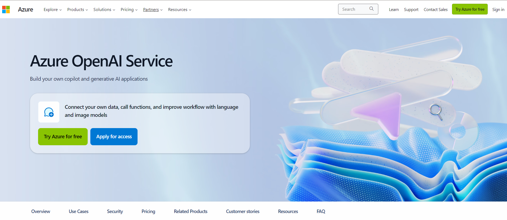
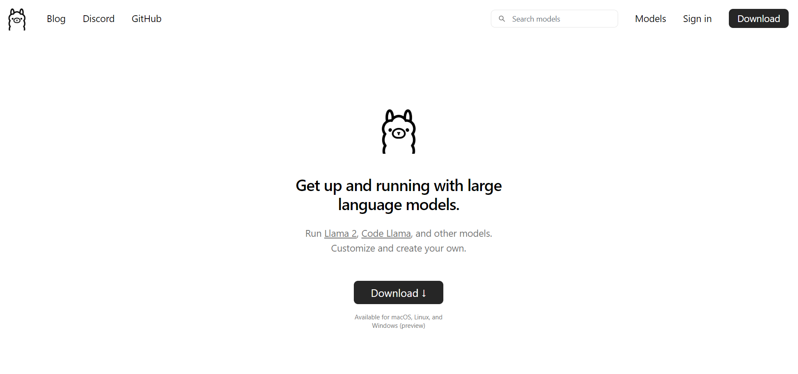
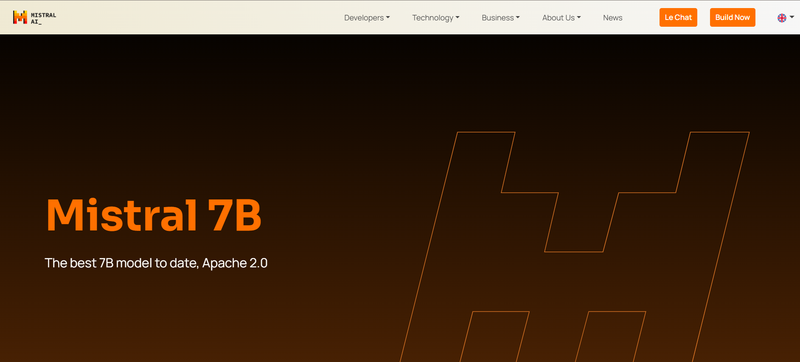
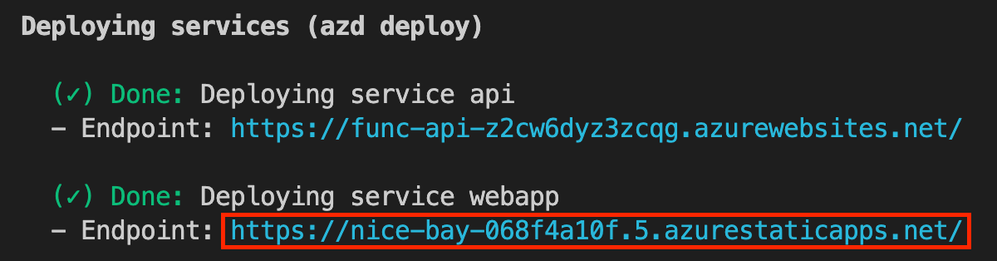
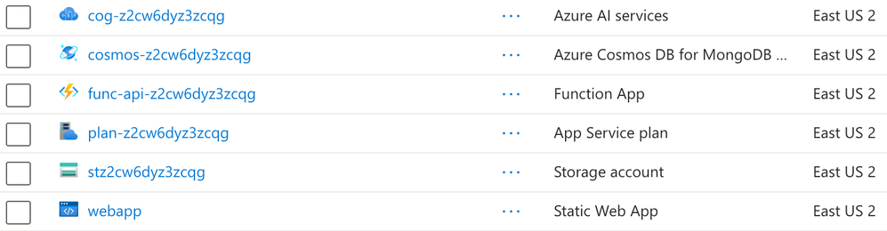
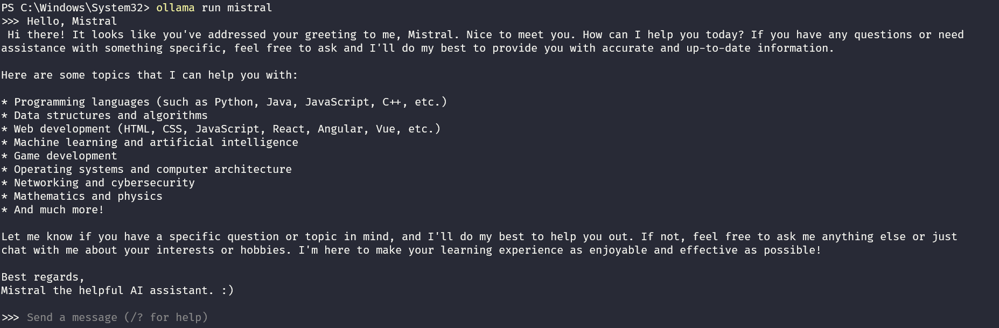

# Preparing and Understanding Language Models: Configuring Azure OpenAI Service and Installing Ollama with Llama3.1 8B

This section we will cover the language models used in the project. Throughout the tutorial, we will also learn how to generate the environment variables needed to use the Azure Services, including the **[Azure OpenAI Service](https://learn.microsoft.com/azure/ai-services/openai/overview)**.

We will also teach you how to use **[Ollama](https://ollama.com/)** with **[Llama3.1 8B](https://www.llama.com/)**, an Open Source Language Model, if you want to use it locally.

## Models to be used in the project

We will teach you how to use two different language models: GPT-3.5 Turbo integrated with _Azure OpenAI Service_ (on Azure) and _Ollama with Llama3.1 8B_ (if you decide to use a model locally). Let's take a look at each of them.

### GPT-3.5 Turbo Integrated with Azure OpenAI Service



OpenAI has developed GPT-3.5 Turbo, an improved version of the already impressive GPT-3.5. This model provides faster and more correct responses, making it a reliable tool for companies and developers who need to generate text or perform other tasks related to Natural Language Processing (NLP).

You have the choice to use either **[OpenAI Service](https://openai.com/)** or **[Azure OpenAI Service](https://azure.microsoft.com/products/ai-services/openai-service)**. For this tutorial, we will be using Azure OpenAI Service, a version of OpenAI Service hosted on the Azure platform.

Azure OpenAI Service provides REST API access in many programming languages, including Python, Node.js, and C#. Additionally, it offers advanced language models like GPT-4, GPT-4-Turbo with Vision, which are versatile and adaptable to various tasks such as content generation, summarization, image recognition, semantic search, and text-to-code translation.

### Ollama with Llama3.1 8B



**[Ollama](https://ollama.com/)** presents itself as an open-source solution, offering a transparent and modifiable platform. The Llama3.1 8B has 8 billion parameters and is designed to be effective, efficient in terms of cost and scability.

Ollama's openness encourages innovation and collaboration within the developer community. Users can adapt the model to their specific needs, experiment with innovative ideas, or integrate the model in ways that proprietary services might not allow.

Additionally, using an open-source language model can decrease expenses, which is a crucial factor for projects with restricted budgets or for those who only wish to experiment with language models.



## Creating Azure resources

To use the Azure OpenAI Service, you need an Azure account. If you don't have one, you can create one for free [here](https://azure.microsoft.com/pt-br/free/).

> **Note:** if you are a student, you can get free credits for Azure through Microsoft Azure for Students.

> **Note:** if you decide to use the Azure OpenAI Service, you must fill out a request form to access the service. You can request access to the service by filling out the form [here](https://aka.ms/oaiapply).

After creating your Azure account and being approved of the Azure OpenAI Service, we will continue as follows:

> **Note:** Instead of PowerShell, you can also use Git Bash or WSL to run the Azure Developer CLI commands.

| Step | Description                                                                                                                                                                                                                                                                                                                                                                                                                                                              |
| ---- | ------------------------------------------------------------------------------------------------------------------------------------------------------------------------------------------------------------------------------------------------------------------------------------------------------------------------------------------------------------------------------------------------------------------------------------------------------------------------ |
| 1    | Return to the `main` branch of the project repository.                                                                                                                                                                                                                                                                                                                                                                                                                   |
| 2    | Open a terminal at the root of the project.                                                                                                                                                                                                                                                                                                                                                                                                                              |
| 3    | To deploy the application to Azure, run the command **run azd**. This will provision Azure resources, deploy the sample, and build the search index based on the files found in the **./data** folder.                                                                                                                                                                                                                                                                   |
| 4    | You will be prompted to select a base location for the resources. If you don't know which one to choose, you can select **eastus2**.                                                                                                                                                                                                                                                                                                                                     |
| 5    | By default, the OpenAI resource will be deployed to **eastus2**. You can set a different location with `azd env set AZURE_OPENAI_RESOURCE_GROUP_LOCATION <location>`. Currently only a brief list of locations is accepted. That location list is based on the **[OpenAI model availability table](https://learn.microsoft.com/pt-br/azure/ai-services/openai/concepts/models#standard-deployment-model-availability)** and may become outdated as availability changes. |

The deployment process will only take a few minutes. Afterward, the URL of the web app will appear in the terminal.



Open the link for the web app in your browser and start chatting with the bot.

To check the resources created, go to the Azure portal and look for a resource group containing the following resources:



The templates used to deploy the resources can be found in the `infra` folder, where we used Infrastructure as Code to set up the resources.

> **Note:** if you want to simply browse the project code and see it in action, go to the `main` branch where the entire application is ready and follow the steps described in the article [Build a serverless AI Chat with RAG using LangChain.js](https://techcommunity.microsoft.com/t5/apps-on-azure-blog/build-a-serverless-chatgpt-with-rag-using-langchain-js/ba-p/4111041), written by **[Yohan Lasorsa](https://twitter.com/sinedied)**.

## Installing Ollama and Local Models

Before installing Ollama, please ensure you meet the prerequisites, which include sufficient free space, recommended amounts of RAM, and a fast CPU or GPU. For more details about running LLM locally, see **[here](open-webui/open-webui#736)**.

#### Memory requirements

- _7b models generally require at least 8GB of RAM_
- _13b models generally require at least 16GB of RAM_
- _70b models generally require at least 64GB of RAM_

> **Note:** If you encounter issues with higher quantization levels, consider using the q4 model or close any other memory-intensive programs.

> **Note:** Ollama supports various operating systems such as Linux, MacOS, and Windows. For installation details, visit the official project documentation **[here](https://ollama.com/download)**.

> **Note:** Ollama cannot be used in Codespaces. It must be installed on a local machine for use.

To begin, download the necessary models for this project by running the following commands in your terminal:

```bash
ollama pull llama3.1:latest
ollama pull nomic-embed-text:latest
```

We will use the Llama3.1 8B model, a powerful language model, and the All-MiniLM model, a small embedding model, to generate vectors from the text for the chatbot.

> **Note:** The Llama3.1 model will download several gigabytes of data, so the process may take some time depending on your internet connection.

After downloading the models, you can verify the proper functioning of the Ollama server by executing the following command:

```bash
ollama run llama3.1:latest
```

An invite will be displayed in your terminal, allowing you to directly communicate with the AI model in a chat-like format.



Ask the model some questions and watch the answers. This will provide insight into the model's capabilities and how to interact with it.

After to finish to test the Ollama server, you can stop it by pressing **Ctrl+D** in your terminal.

## Next Steps

This tutorial covers language models that will be used in the project. Choose the best model to suit your needs. To use the Azure OpenAI Service, follow the instructions to set up the service in Azure. To use Ollama with Llama3.1 8B, follow the instructions to install Ollama and the local models.

To begin developing the application, we first need to create some configuration files for the project. We'll cover this in the next section!

**[⬅️ Back: Understanding the RAG (Retrieval Augmented Generation) architecture](03-understanding-rag.md)** | **[Next: Developing the `chat` API ➡️ ](./05-config-files-app.md)**
