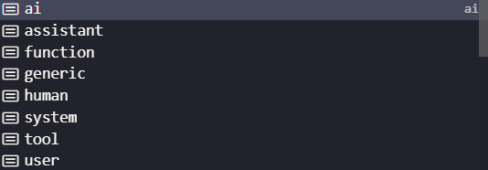
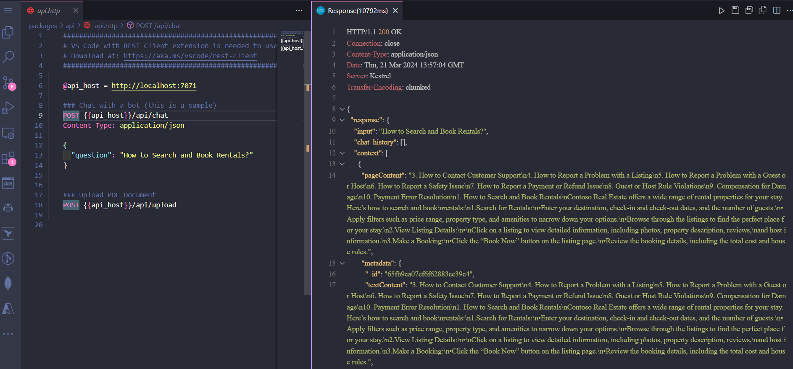
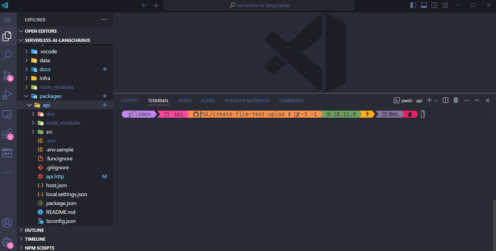

# Generate completion using `chain` in the `chat` API

In this session, we will learn how to use a very important feature in LangChain.js: `chain`.

## What are `chains`?

`Chains` in large language models (LLMs), such as GPT (Generative Pre-trained Transformer), refer to a technique where the outputs of a previous interaction are used as inputs for the next interaction with the model. This allows for a continuous and coherent conversation or thought process, where each new response takes into account the previous context, creating a "chain" of connected interactions.

For example, if you ask the model about the recipe for a cake and then want to know how to change that recipe to make it vegan, the model will use the information from the previous conversation about the cake recipe to provide a relevant and specific answer about how to make the vegan version, rather than starting from scratch. This is useful for maintaining continuity and relevance in conversations or the processing of sequential information.

And, of course, **[LangChain.js supports this functionality](https://js.langchain.com/docs/expression_language/streaming#chains)**. Let's see how we can use it.

## Integrating `ChatPromptTemplate` for dynamics interactions

Open the `chat.ts` file and let's make some significant changes to this code.

- `packages/packages/api/functions/chat.ts`:

```typescript
import { app, HttpRequest, HttpResponseInit, InvocationContext } from '@azure/functions';
import { badRequest, serviceUnavailable } from '../utils';
import { AzureChatOpenAI, AzureOpenAIEmbeddings } from '@langchain/azure-openai';
import { ChatPromptTemplate } from '@langchain/core/prompts';

import 'dotenv/config';

export async function chat(request: HttpRequest, context: InvocationContext): Promise<HttpResponseInit> {
  try {
    const requestBody: any = await request.json();

    if (!requestBody?.question) {
      return badRequest(new Error('No question provided'));
    }

    const { question } = requestBody;

    const embeddings = new AzureOpenAIEmbeddings();

    const model = new AzureChatOpenAI();

    const questionAnsweringPrompt = ChatPromptTemplate.fromMessages([
      ['system', "Answer the user's questions based on the below context:\n\n{context}"],
      ['human', '{input}'],
    ]);

    return {
      status: 200,
      body: 'Testing chat function.',
    };
  } catch (error: unknown) {
    const error_ = error as Error;
    context.error(`Error when processing request: ${error_.message}`);

    return serviceUnavailable(new Error('Service temporarily unavailable. Please try again later.'));
  }
}

app.http('chat', {
  route: 'chat',
  methods: ['POST'],
  authLevel: 'anonymous',
  handler: chat,
});
```

Let's understand what we did here:

First, we import the `ChatPromptTemplate` class from the `@langchain/core/prompts` package to create a chat prompt. This class is used to create a chat prompt that can be used to interact with the language model.

Next, we create a conversation prompt called `questionAnsweringPrompt` that will be used to create a conversation with the language model.

You will notice that right after we use the `ChatPromptTemplate` class, we are using the `fromMessages` method. This method is needed precisely to create a specific chat template prompt from individual chat messages or message-like tuples. That's why the return of this method is an array. So much so that, if you hit `CTRL + SPACE` in your code editor, you will see the following options below:



In this case, we put as the first parameter the type of message we are sending, which is `system` and `human`. The second parameter is the message we are sending. In this case, the system message is `Answer the user's questions based on the below context:\n\n{context}` and the user message is `{input}`.

## Implementing a `chain` for the `chat` API

Now that we've created a more dynamic chat, let's implement the `chain` so that the conversation is more fluid and coherent. To do this, add the following code right after creating the `questionAnsweringPrompt`:

```typescript
(... the previous code ...)

    const combineDocsChain = await createStuffDocumentsChain({
      llm: model,
      prompt: questionAnsweringPrompt,
    });

    const store = new AzureCosmosDBVectorStore(embeddings, {});

    const chain = await createRetrievalChain({
      retriever: store.asRetriever(),
      combineDocsChain,
    });

    const response = await chain.invoke({
      input: question
    });

    return response
      ? ok({ response })
      : serviceUnavailable(new Error('Service temporarily unavailable. Please try again later.'));
  } catch (error: unknown) {
    const error_ = error as Error;
    context.error(`Error when processing chat request: ${error_.message}`);

    return serviceUnavailable(new Error('Service temporarily unavailable. Please try again later.'));
  };

app.http('chat', {
  route: 'chat',
  methods: ['POST'],
  authLevel: 'anonymous',
  handler: chat,
});
```

Let's understand again in each line what we did:

We created a `combineDocsChain` using the `createStuffDocumentsChain` function.

This function is used to create a string that passes a list of documents to a template. There a few parameters in this function. There include `llm`, which is the language model we are using, and `prompt`, which is the conversation we are having with the model. We will use them to create the chain.

Just as we did in the `upload` API, we will need to store the vectors in the database. To do this, we created a variable called `store` so that we can instantiate the `AzureCosmosDBVectorStore` class. This class is used to create a vector that can be used to store and retrieve vectors from the language model.

We create the `chain` using the `createRetrievalChain` function. This function is used precisely to create a retrieval chain that will retrieve the documents and then pass them on to the chat. That's why this function has two parameters:

- `retriever`: which aims to return a list of documents.
- `combineDocsChain`: which will reproduce a string output.

Finally, we invoked the `chain` using the `invoke` method. This method is used to invoke the chain with the input question and get the response from the language model.

Wow! we have completed our `chat` API. Now, let's test our API together with the `upload` API.

## Testing the `chat` API

To test the two APIs, let's open the terminal again and run the following command inside the `packages/api` folder:

```bash
npm run start
```

The message related to the `chat` and `upload` API will appear again. Open a new terminal and include the following command:

```bash
curl -F "file=@data/support.pdf" http://localhost:7071/api/upload
```

If all goes well, you will see the following message:

```json
{
  "message": "PDF file uploaded successfully."
}
```

Now, let's test the `chat` API. To do this, go to the `api.http` file. We'll be using the `REST Client` extension to test the `chat` API. When it opens, send the request and see the result.



You will see the exact response requested in the `chat` request. If you want to see the whole process, take a look at the gif below:



We haven't finished our project yet. We still have one more very important item that we mustn't forget to implement in a chat: `stream` response. We'll learn how to do this in the next session.

▶ **[Next Step: Generate `stream` response](./05-session.md)**
