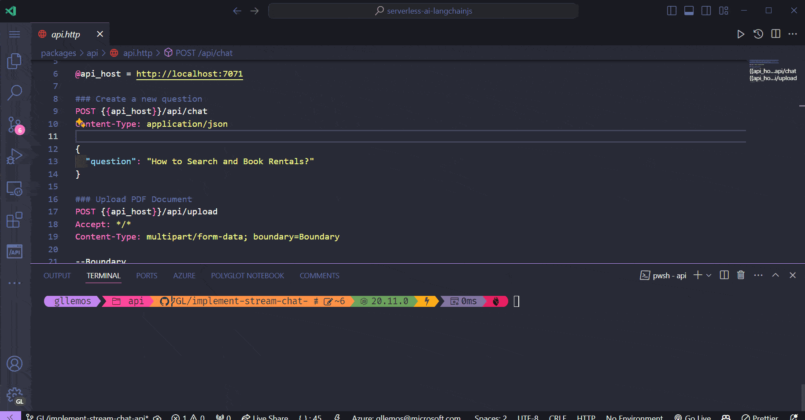

# Generate a stream response in the `chat` API

In this session, we will learn how to generate a stream response in the `chat` API, using LangChain.js and including the new feature on stream available also for the v4 of the Azure Functions programming model.

## What is streaming?

Streaming is crucial for Large Language models (LLMs) for several reasons:

- **It manages memory resources efficiently**: allowing models to process long texts without overloading memory.
- **It improves scalability**: making it easier to process inputs of virtually unlimited size.
- **Reduces latency in real-time interactions**: providing faster responses in virtual assistants and dialog systems.
- **Facilitates training and inference** on large data sets, making the use of LLMs more practical and efficient.
- **It can improve the quality of the text generated**: helping models to focus on smaller pieces of text for greater cohesion and contextual relevance.
- **Supports distributed workflows**: allowing models to be scaled to meet intense processing demands.

As such, certain large language models (LLMs) have the ability to send responses sequentially. This means that you don't need to wait for the full response to be received before you can start working with it. This feature is especially advantageous if you want to show the response to the user as it is produced or if you need to analyze and use the response while it is being formed.

And LangChain.js supports the use of streaming. Making use of the `.stream()` method. If you want to know more about the `.stream()` method, you can access the **[official LangChain.js documentation](https://js.langchain.com/docs/use_cases/question_answering/streaming#chain-with-sources)**.

## Support for HTTP Streams in Azure Functions

The Azure Functions product team recently announced the availability of support for HTTP Streams in version 4 of the Azure Functions programming model. With this, it is now possible to return stream responses in HTTP APIs, which is especially useful for real-time data streaming scenarios.

To find out more about streaming support in Azure Functions v4, you can visit Microsoft's Tech Community blog by clicking **[here](https://techcommunity.microsoft.com/t5/apps-on-azure-blog/azure-functions-support-for-http-streams-in-node-js-is-now-in/ba-p/4066575)**.

## Enabling HTTP Streams support in Azure Functions

Well, now that we've understood the importance of using streaming in a chat and how useful it can be, let's learn how we can introduce it into the `chat` API.

The first thing we need to do is enable the new Azure Functions feature, which is streaming support. To do this, open the file `chat.ts` and include the following code:

- `api/functions/chat.ts`

```typescript
(... previous code ...)

app.setup({ enableHttpStream: true });
app.post('chat', {
  route: 'chat',
  authLevel: 'anonymous',
  handler: chat,
});
```

So the `chat.ts` file will look like this:

- `api/functions/chat.ts`

```typescript
import { Readable } from 'node:stream';
import { Document } from '@langchain/core/documents';
import { HttpRequest, InvocationContext, HttpResponseInit, app } from '@azure/functions';
import { AzureOpenAIEmbeddings, AzureChatOpenAI } from '@langchain/azure-openai';
import { ChatPromptTemplate } from '@langchain/core/prompts';
import { createStuffDocumentsChain } from 'langchain/chains/combine_documents';
import { AzureCosmosDBVectorStore } from '@langchain/community/vectorstores/azure_cosmosdb';
import { createRetrievalChain } from 'langchain/chains/retrieval';
import 'dotenv/config';
import { badRequest, serviceUnavailable } from '../utils';

export async function chat(request: HttpRequest, context: InvocationContext): Promise<HttpResponseInit> {
  context.log(`Http function processed request for url "${request.url}"`);

  try {
    const requestBody: any = await request.json();

    if (!requestBody?.question) {
      return badRequest(new Error('No question provided'));
    }

    const { question } = requestBody;

    const embeddings = new AzureOpenAIEmbeddings();

    const prompt = `Question: ${question}`;
    context.log(`Sending prompt to the model: ${prompt}`);

    const model = new AzureChatOpenAI();

    const questionAnsweringPrompt = ChatPromptTemplate.fromMessages([
      ['system', "Answer the user's questions based on the below context:\n\n{context}"],
      ['human', '{input}'],
    ]);

    const combineDocsChain = await createStuffDocumentsChain({
      llm: model,
      prompt: questionAnsweringPrompt,
    });

    const store = new AzureCosmosDBVectorStore(embeddings, {});

    const chain = await createRetrievalChain({
      retriever: store.asRetriever(),
      combineDocsChain,
    });

    const response = await chain.stream({
      input: question,
    });

    return {
      headers: { 'Content-Type': 'text/plain' },
      body: createStream(response),
    };
  } catch (error: unknown) {
    const error_ = error as Error;
    context.error(`Error when processing chat request: ${error_.message}`);

    return serviceUnavailable(new Error('Service temporarily unavailable. Please try again later.'));
  }
}

function createStream(chunks: AsyncIterable<{ context: Document[]; answer: string }>) {
  const buffer = new Readable({
    read() {},
  });

  const stream = async () => {
    for await (const chunk of chunks) {
      buffer.push(chunk.answer);
    }

    buffer.push(null);
  };

  stream();

  return buffer;
}

app.setup({ enableHttpStream: true });
app.post('chat', {
  route: 'chat',
  authLevel: 'anonymous',
  handler: chat,
});
```

And that's it! Azure Functions is now enabled to support streaming.

## Generating a stream response in the `chat` API

Now, let's move on and create the logic to generate a stream response in the `chat` API.

Open the `chat.ts` file and let's make some significant changes:

- `chat.ts`

```typescript
import { Readable } from 'node:stream';
import { Document } from '@langchain/core/documents';
import { HttpRequest, InvocationContext, HttpResponseInit, app } from '@azure/functions';
import { AzureOpenAIEmbeddings, AzureChatOpenAI } from '@langchain/azure-openai';
import { ChatPromptTemplate } from '@langchain/core/prompts';
import { createStuffDocumentsChain } from 'langchain/chains/combine_documents';
import { AzureCosmosDBVectorStore } from '@langchain/community/vectorstores/azure_cosmosdb';
import { createRetrievalChain } from 'langchain/chains/retrieval';
import 'dotenv/config';
import { badRequest, serviceUnavailable } from '../utils';

export async function chat(request: HttpRequest, context: InvocationContext): Promise<HttpResponseInit> {
  try {
    const requestBody: any = await request.json();

    if (!requestBody?.question) {
      return badRequest(new Error('No question provided'));
    }

    const { question } = requestBody;

    const embeddings = new AzureOpenAIEmbeddings();

    const prompt = `Question: ${question}`;
    context.log(`Sending prompt to the model: ${prompt}`);

    const model = new AzureChatOpenAI();

    const questionAnsweringPrompt = ChatPromptTemplate.fromMessages([
      ['system', "Answer the user's questions based on the below context:\n\n{context}"],
      ['human', '{input}'],
    ]);

    const combineDocsChain = await createStuffDocumentsChain({
      llm: model,
      prompt: questionAnsweringPrompt,
    });

    const store = new AzureCosmosDBVectorStore(embeddings, {});

    const chain = await createRetrievalChain({
      retriever: store.asRetriever(),
      combineDocsChain,
    });

    const response = await chain.stream({
      input: question,
    });

    return {
      body: createStream(response),
      headers: {
        'Content-Type': 'text/plain',
      },
    };
  } catch (error: unknown) {
    const error_ = error as Error;
    context.error(`Error when processing chat request: ${error_.message}`);

    return serviceUnavailable(new Error('Service temporarily unavailable. Please try again later.'));
  }
}

function createStream(chunks: AsyncIterable<{ context: Document[]; answer: string }>) {
  const buffer = new Readable({
    read() {},
  });

  const stream = async () => {
    for await (const chunk of chunks) {
      buffer.push(chunk.answer);
    }

    buffer.push(null);
  };

  stream();

  return buffer;
}

app.setup({ enableHttpStream: true });
app.post('chat', {
  route: 'chat',
  authLevel: 'anonymous',
  handler: chat,
});
```

Several changes here, right? But let's understand what has been changed and included here:

```typescript
const response = await chain.stream({
  input: question,
});
```

Before, the `chain` variable was using the `invoke()` method. However, as we now want to generate a stream response, we are using the `stream()` method. And passing the `input` parameter with the question the user asked.

After that, we're returning the stream response, using the `createStream()` function.

```typescript
function createStream(chunks: AsyncIterable<{ context: Document[]; answer: string }>) {
  const buffer = new Readable({
    read() {},
  });

  const stream = async () => {
    for await (const chunk of chunks) {
      buffer.push(chunk.answer);
    }

    buffer.push(null);
  };

  stream();

  return buffer;
}

app.setup({ enableHttpStream: true });
app.post('chat', {
  route: 'chat',
  authLevel: 'anonymous',
  handler: chat,
});
```

The `createStream()` function is responsible for generating the stream response. It receives an `AsyncIterable` of `{ context: Document[]; answer: string }` as a parameter. And then creates a `Readable` stream, which is an interface for reading data from a stream.

Note that we are importing:

- `Document` from the `@langchain/core/documents` package: which is an interface for interacting with a document.
- `Readable` from the `node:stream` package: class that belongs to the `stream` module of Node.js, which is an interface for reading data from a stream.

```typescript
return {
  headers: { 'Content-Type': 'text/plain' },
  body: createStream(response),
};
```

And finally, we're returning the stream response using the `createStream()` function. And setting the `Content-Type` header to `text/plain`.

And that's it! Now the `chat` API is ready to generate stream responses.

Let's test the `chat` API and see how it behaves when generating a stream response. To do this, open the terminal again in the `api` folder and run the command:

```bash
npm run start
```

And then open the `api.http` file and send the `chat` API request, and now see the return of the response using the stream in the gif below:



Note that when we send the request, the `Response` header shows `Transfer-Encoding: chunked`, which indicates that the response is being sent in chunks. And the response is displayed sequentially, i.e. as the response is generated, it is displayed.


And that's it! You've now learned how to generate a stream response in the `chat` API using LangChain.js and the new stream feature that is also available for v4 of the Azure Functions programming model.
